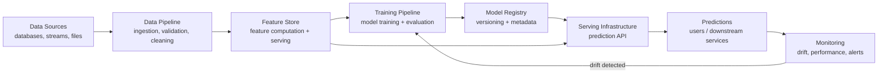
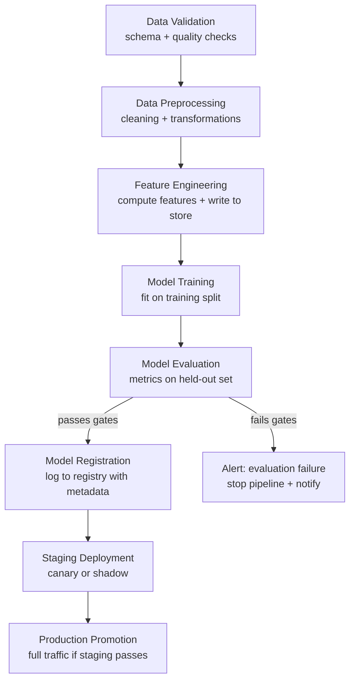
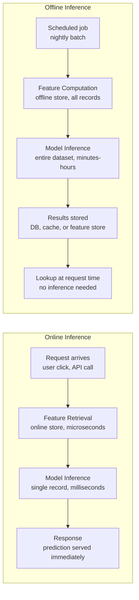

# ML System Design

!!! prerequisite "Before You Start"
    Complete all three preceding MLOps pages before this one: [Project Lifecycle](project-lifecycle.md), [Model Deployment](model-deployment.md), and [Monitoring & Maintenance](monitoring-maintenance.md). This page is the MLOps capstone -- it ties together concepts from all three. You should be comfortable with ML project structure, model serving with FastAPI, and drift detection before proceeding.

*Total time: ~6-8 hours* | :red_circle: Advanced

## Learning Outcomes

By the end of this section, you will:

- Understand the components of a production ML system and how they connect end-to-end
- Know what a feature store is, when you need one, and how it solves training-serving skew
- Be able to evaluate ML pipeline orchestration tools (Airflow, Kubeflow, Prefect) for a given use case
- Understand the architectural tradeoffs between online and offline serving patterns
- Have a structured framework for answering ML system design interview questions

---

## End-to-End ML Architecture

*⏱ ~1.5 hours*

A production ML system is not a single model -- it is a collection of interconnected components that must work together reliably. Most ML courses focus on model training, but in production, training is typically 5-10% of the total engineering work. The other 90% is data pipelines, feature engineering infrastructure, model serving, monitoring, and all the plumbing that makes these components work together at scale.

The canonical reference for production ML system architecture is the 2015 Google paper "Hidden Technical Debt in Machine Learning Systems" by Sculley et al. Their central observation: ML code itself is a small fraction of a real ML system. The surrounding infrastructure -- data collection, feature extraction, process management, serving, monitoring -- is vast, fragile, and easy to underestimate.

Walking through this diagram:

**Data Sources** feed raw data into the system: databases, event streams, logs, external APIs. In production, data arrives continuously and must be handled reliably -- late records, schema changes, and upstream failures are routine.

**Data Pipeline** ingests, validates, and cleans the raw data. Data validation at ingestion time (checking schema, value ranges, null rates) is one of Google's top recommendations for production ML reliability. A data pipeline that silently passes corrupted data downstream is more dangerous than one that fails loudly.

**Feature Store** is discussed in detail in the next section. Its critical role in this architecture is serving consistent features to both the training pipeline and the serving infrastructure -- the same feature values, computed by the same logic.

**Training Pipeline** takes features from the feature store, trains a model, evaluates it against held-out data and the current production model, and (if it passes evaluation gates) pushes the new model to the model registry. The training pipeline should be fully automated and reproducible.

**Model Registry** is the versioned artifact store for trained models. Every model has metadata: who trained it, on what data, with what hyperparameters, and what its evaluation metrics were. The registry enables rollback -- if a new model causes a production incident, you can quickly redeploy the previous version.

**Serving Infrastructure** loads models from the registry and serves predictions. This can be a REST API (FastAPI, Flask, TorchServe), a gRPC server for low-latency systems, a batch scoring system, or a streaming inference service depending on latency and throughput requirements.

**Monitoring** observes prediction quality, input distribution, system health, and business metrics. When monitoring detects significant drift or performance degradation, it triggers the training pipeline to retrain with fresh data.

**The feedback loop from monitoring back to training is the defining characteristic of a mature ML system.** Systems without this loop require manual intervention to retrain -- they will silently degrade until a human notices.

!!! tip "Teaching Moment"
    The diagram above looks clean and well-organized. Production systems are messier: data sources change schemas without warning, features are inconsistently computed between training and serving, model registry metadata is incomplete, monitoring alerts fire on irrelevant distributions. The gap between the clean architecture diagram and the messy reality is where most production ML incidents originate. Chip Huyen's "Designing ML Systems" is valuable precisely because it documents the reality, not just the idealized architecture.

!!! tip "Why This Path"
    Chip Huyen dedicates Chapters 10-11 of "Designing ML Systems" to ML infrastructure and the ML platform. Most other ML books stop at model training. Understanding ML system architecture has become a core competency for senior ML engineers: ML system design interviews are increasingly common at top tech companies (Meta, Google, Stripe, Airbnb). Made With ML's curriculum builds system design as an explicit skill: their open-source repository covers the full stack from data validation to monitoring dashboards. System design is where MLOps moves from tool familiarity to architectural thinking.

!!! action "What to Do"
    1. 📖 Read Chip Huyen "Designing ML Systems" Ch. 10 (ML Infrastructure) and Ch. 11 (The ML Platform) for a comprehensive treatment of production system components
    2. 📖 Read the original Sculley et al. paper ["Hidden Technical Debt in Machine Learning Systems"](https://papers.nips.cc/paper/5656-hidden-technical-debt-in-machine-learning-systems.pdf) -- still the most important paper on ML system engineering
    3. 🎥 Watch the Full Stack Deep Learning "ML Systems" lecture series for practical architecture examples
    4. 📖 Browse the [Made With ML](https://madewithml.com/) open-source project -- it implements the full system architecture shown above

**Resources:**

- 📘 [Chip Huyen: Designing ML Systems, Ch. 10-11](https://www.oreilly.com/library/view/designing-machine-learning/9781098107963/) -- Chapters 10-11 cover ML infrastructure and the ML platform at production scale (~$50)
- 📖 [Sculley et al.: Hidden Technical Debt](https://papers.nips.cc/paper/5656-hidden-technical-debt-in-machine-learning-systems.pdf) -- The seminal paper on production ML system complexity; required reading for senior ML engineers (Free)
- 📖 [Made With ML](https://madewithml.com/) -- End-to-end production ML system implementation: the architecture above as working code (Free)
- 📖 [Eugene Yan: Practical ML for Engineers](https://eugeneyan.com/) -- Blog with detailed case studies of production ML systems at Amazon and elsewhere (Free)

---

## Feature Stores

*⏱ ~1 hour*

A feature store is infrastructure for computing, storing, and serving ML features consistently across training and serving. The problem it solves is called **training-serving skew**: the phenomenon where the features computed during training are not identical to the features served during inference.

Training-serving skew is one of the most common and hardest-to-diagnose bugs in production ML. It usually happens like this: a data scientist computes features in Python during training using the training dataset. An engineer independently implements the same feature logic in the serving system, perhaps in a different language or with different data sources. The two implementations diverge slightly -- different null handling, different rounding, different aggregation windows -- and the model receives slightly different features during serving than it was trained on. The model performs worse in production than in evaluation, and it is very hard to diagnose because the feature logic "looks correct" in both places.

**A feature store enforces consistency** by making one system responsible for both computing features for training and serving them at inference time.

Feature stores have two components:

**Offline store** -- A batch-oriented storage system (data warehouse, S3 + Parquet, or a dedicated store like Feast's offline store) that holds historical feature values. The training pipeline queries the offline store to retrieve features for any time window. This enables point-in-time correct feature retrieval: "give me the feature values as they were at timestamp T for each training example." This prevents data leakage from features computed with future information.

**Online store** -- A low-latency key-value store (Redis, DynamoDB, Cassandra) that holds the most recent feature values. The serving infrastructure queries the online store at inference time to retrieve feature values for a given entity (user ID, item ID, session ID) in milliseconds.

The same feature transformation pipeline writes to both stores: computed features land in the offline store for training and in the online store for serving. This enforces consistency.

**When do you need a feature store?**

| Situation | Need Feature Store? |
|-----------|-------------------|
| Solo/research project | No -- pandas pipelines are fine |
| Team with 1-2 models | Probably not -- document feature logic carefully |
| Multiple teams sharing features | Yes -- shared feature store prevents duplication |
| Real-time features required | Yes -- online store for low-latency serving |
| Training-serving skew diagnosed | Yes -- feature store is the fix |
| More than 5 models in production | Likely yes -- feature governance becomes valuable |

Popular options:

- **Feast** -- Open-source, widely used, integrates with most cloud platforms
- **Tecton** -- Managed cloud feature platform, strong real-time capabilities
- **Hopsworks** -- Open-source with managed cloud option, strong offline store
- **Vertex AI Feature Store** (GCP), **SageMaker Feature Store** (AWS) -- Cloud-native options

!!! tip "Teaching Moment"
    The most important property of a feature store is not speed or scale -- it is consistency. The offline and online stores must contain features computed by the same logic, or training-serving skew re-emerges. This is why "just use Redis for serving" without a feature store is an incomplete solution: you still have two independent codepaths computing features, and they will diverge. A feature store's value is the guarantee of a single computation path feeding both training and serving.

!!! action "What to Do"
    1. 📖 Read the [Feast documentation introduction](https://docs.feast.dev/getting-started/architecture) to understand the offline/online store architecture
    2. 📖 Read Eugene Yan's blog post ["Feature Stores for ML"](https://eugeneyan.com/writing/feature-stores/) for a practitioner's view of when to build vs buy
    3. 💻 Try the [Feast quickstart](https://docs.feast.dev/getting-started/quickstart) -- it runs locally and demonstrates the offline/online store pattern in 30 minutes
    4. 📖 Read Chip Huyen "Designing ML Systems" Ch. 5 (Feature Engineering) for context on feature computation challenges in production

**Resources:**

- 💻 [Feast: Open-Source Feature Store](https://feast.dev/) -- The most widely-used open-source feature store; local quickstart available (Free)
- 📖 [Eugene Yan: Feature Stores for ML](https://eugeneyan.com/writing/feature-stores/) -- Practitioner-focused guide with tradeoffs between options (Free)
- 📘 [Chip Huyen: Designing ML Systems, Ch. 5](https://www.oreilly.com/library/view/designing-machine-learning/9781098107963/) -- Feature engineering and feature pipeline design for production (~$50)
- 📖 [Hopsworks: Feature Store Comparison](https://www.hopsworks.ai/post/feature-store-comparison) -- Side-by-side comparison of major feature store options (Free)

---

## ML Pipeline Orchestration

*⏱ ~1 hour*

Production ML pipelines are DAGs (directed acyclic graphs) of tasks: data validation runs before feature engineering, feature engineering runs before training, training runs before evaluation, and evaluation gates the decision to register the new model. Orchestrating these dependencies reliably -- across failures, retries, and parallel execution -- is the job of a pipeline orchestrator.

The key properties you need from an orchestrator:

- **Dependency management**: task B runs only after task A completes successfully
- **Retry logic**: if a task fails due to transient errors, retry with backoff
- **Scheduling**: run the pipeline on a schedule (daily, weekly) or trigger it on events (new data available, drift detected)
- **Observability**: log task states, durations, and failures; provide a UI to inspect runs
- **Parameterization**: run the same pipeline with different data windows or hyperparameters

**Apache Airflow** is the most widely used ML pipeline orchestrator. It defines pipelines as Python DAGs and provides a web UI for monitoring runs. It was built for data engineering workflows and has a large ecosystem. The learning curve is moderate and it can be heavy to self-host, but many cloud providers offer managed Airflow.

**Kubeflow Pipelines** is Kubernetes-native and was designed specifically for ML workflows. Each step runs in a Docker container, enabling GPU allocation and reproducible execution environments. The tradeoff: it requires a Kubernetes cluster and has a steeper learning curve than Airflow.

**Prefect** has a more modern Python API than Airflow and is easier to get started with. It treats tasks as Python functions decorated with `@task`, making pipelines feel more natural to ML engineers. The managed cloud (Prefect Cloud) provides observability without self-hosting.

**Choosing an orchestrator:**

| Factor | Airflow | Kubeflow | Prefect |
|--------|---------|----------|---------|
| Ecosystem maturity | Highest | High | Growing |
| Kubernetes required | No | Yes | No |
| ML-specific features | Limited | Strong | Limited |
| Learning curve | Moderate | High | Low |
| Best for | Data engineering + ML | ML on Kubernetes | ML-friendly Python |

!!! tip "Teaching Moment"
    The most common mistake with ML pipeline orchestration is skipping it entirely in early stages and using cron jobs or manual scripts. This works fine for one model. It breaks down at three models, and becomes unmanageable at ten. The time to introduce orchestration is before you have too many manual scripts to track -- not after. Starting with Prefect (low learning curve) and migrating to Airflow or Kubeflow as scale demands is a reasonable progression.

!!! action "What to Do"
    1. 💻 Work through the [Prefect quickstart](https://docs.prefect.io/latest/getting-started/quickstart/) -- build a simple ML training pipeline with `@task` and `@flow` decorators
    2. 📖 Read the [Airflow documentation concepts guide](https://airflow.apache.org/docs/apache-airflow/stable/concepts/overview.html) to understand DAGs, operators, and scheduling
    3. 📖 Read Made With ML's ["MLOps: Orchestration"](https://madewithml.com/) section for a worked example of a production ML training DAG
    4. 🎥 Watch the Full Stack Deep Learning lecture on ML pipelines and orchestration for architecture context

**Resources:**

- 💻 [Prefect Documentation](https://docs.prefect.io/) -- Modern Python-native orchestration; local quickstart requires only Python (Free)
- 💻 [Apache Airflow](https://airflow.apache.org/) -- Industry-standard orchestration with massive ecosystem; run locally via `pip install apache-airflow` (Free)
- 💻 [Kubeflow Pipelines](https://www.kubeflow.org/docs/components/pipelines/) -- Kubernetes-native ML pipelines; requires a cluster but local minikube works for learning (Free)
- 📖 [Made With ML: Orchestration](https://madewithml.com/) -- Practical ML pipeline with Airflow/Prefect in the context of a full ML system (Free)
- 🎥 [Full Stack Deep Learning: ML Infrastructure](https://fullstackdeeplearning.com/course/2022/) -- Lecture covering pipeline orchestration and infrastructure decisions (Free)

---

## Online vs Offline Serving Architectures

*⏱ ~1 hour*

How you serve predictions depends on two factors: latency requirements and whether you know the input in advance. These two factors determine whether you should use online (real-time) inference or offline (batch) inference.

**Online (real-time) inference** computes predictions at request time. The user or calling service sends input features, the serving API retrieves any additional features from the online store, runs the model, and returns a prediction -- typically within 100-500ms for most applications, under 10ms for latency-sensitive systems (ad ranking, fraud scoring).

Use online inference when:
- Predictions depend on information available only at request time (the exact text a user typed, their current location)
- Personalization requires real-time user context
- Latency requirements are under a few seconds
- Input space is too large to pre-compute all predictions

**Offline (batch) inference** pre-computes predictions for all entities in advance and stores the results. At request time, the serving layer does a database lookup -- no model inference needed. This is extremely fast (single-digit milliseconds for a database read) and puts no load on the model at serving time.

Use offline inference when:
- The input space is finite and enumerable (all product IDs, all user IDs)
- Predictions do not need to reflect real-time state
- Throughput requirements are high but latency tolerance is large (overnight batch jobs)
- Model inference is expensive and you want to amortize the cost

**Hybrid patterns** combine both: pre-compute predictions for common cases (top 1000 users by activity), serve online for the long tail. Caching is a common hybrid: the online serving path checks a cache first; if there is a hit, return cached prediction; if not, run inference and cache the result with a TTL.

**Latency budget decomposition** is how you reason about online serving performance. A total latency budget of, say, 200ms gets allocated: 10ms for DNS/network, 5ms for feature retrieval from online store, 150ms for model inference, 15ms for response serialization. If model inference takes 150ms, you know you cannot serve a large transformer model online without optimization (quantization, distillation, or switching to a distilled model).

!!! tip "Teaching Moment"
    The serving pattern you choose at the start is hard to change later -- the application code that calls your service is built around the assumption of real-time responses or pre-computed lookups. Before building serving infrastructure, explicitly document: what is the latency requirement? What is the maximum staleness of predictions you can tolerate? Can inputs be pre-enumerated? These three questions almost completely determine whether online or offline serving is appropriate. Getting this decision wrong early is expensive to fix.

!!! action "What to Do"
    1. 📖 Read Chip Huyen "Designing ML Systems" Ch. 7 (Model Deployment and Prediction Service) for a comprehensive treatment of serving patterns
    2. 📖 Read Eugene Yan's blog post ["Patterns for Building NLP-powered Features"](https://eugeneyan.com/writing/nlp-supervised-learning-survey/) for real-world examples of online vs offline serving at Amazon
    3. 💻 Build both serving patterns: use the FastAPI serving example from the deployment page for online inference; extend it to add a pre-compute step that stores predictions in a dictionary (simulating a cache)
    4. 📖 Read the Made With ML section on "Serving" for a worked example of the prediction service architecture

**Resources:**

- 📘 [Chip Huyen: Designing ML Systems, Ch. 7](https://www.oreilly.com/library/view/designing-machine-learning/9781098107963/) -- Deployment and prediction service patterns with architecture tradeoffs (~$50)
- 📖 [Eugene Yan: Applied ML Blog](https://eugeneyan.com/) -- Practitioner case studies on serving architectures at Amazon, often including online/offline tradeoffs (Free)
- 📖 [Made With ML: Serving](https://madewithml.com/) -- Practical ML prediction service implementation with FastAPI (Free)
- 🎥 [Full Stack Deep Learning: Deployment](https://fullstackdeeplearning.com/course/2022/) -- Lecture on serving architectures and deployment patterns (Free)
- 📖 [DDIA: Chapter 10-11](https://dataintensive.net/) -- Kleppmann's "Designing Data-Intensive Applications" for the data systems underlying ML serving (e.g., stream processing, batch jobs) (~$50)

---

## ML System Design Interview Patterns

*⏱ ~1 hour*

ML system design interviews ask you to design a complete ML system in 45-60 minutes: "Design a recommendation system for Netflix," "Design a fraud detection system for a payments company," "Design a search ranking system." These interviews test architectural thinking, not ML algorithm knowledge.

**A structured approach for design interviews:**

**Step 1: Clarify the problem (5 minutes)**
Ask about scale (users, QPS, data volume), latency requirements, freshness requirements, and success metrics. Most candidates skip this and design for the wrong problem.

**Step 2: Frame as an ML problem (5 minutes)**
Define the input, output, and ML task type. Is this supervised classification, ranking, regression, or something else? Define the training signal (what labels do you have or can you collect?).

**Step 3: Data pipeline (10 minutes)**
Where does training data come from? What are the key features? How do you handle cold start (new users/items with no history)?

**Step 4: Model choice (10 minutes)**
Start simple. Justify your model choice with tradeoffs. For most interview scenarios, a well-reasoned simple model (logistic regression, gradient boosting) beats an unjustified deep model.

**Step 5: Serving architecture (10 minutes)**
Online or offline? Latency requirements? Feature retrieval? Model serving infrastructure?

**Step 6: Evaluation and monitoring (10 minutes)**
Offline evaluation metrics and online A/B testing. What do you monitor? What triggers retraining?

**Common design patterns by problem type:**

**Recommendation System (Netflix, Spotify, Amazon)**
- Two-stage: candidate generation (narrow from millions to hundreds) + ranking (score hundreds to return top N)
- Candidate generation: collaborative filtering (matrix factorization) or embedding similarity
- Ranking: gradient boosting or neural network on user-item features
- Training signal: implicit feedback (clicks, watches, purchases)
- Cold start: fallback to popularity, content-based recommendations, or explicit preference elicitation

**Fraud Detection (Stripe, PayPal, banks)**
- Binary classification: fraudulent transaction vs legitimate
- Features: transaction amount, merchant category, user velocity features, device fingerprint, historical pattern
- Class imbalance: fraud is rare (0.1-1% of transactions); requires oversampling, class weights, or calibration
- Latency: must complete within the transaction approval window (100-200ms)
- Concept drift: fraud patterns change rapidly; triggered retraining essential
- Confidence threshold tuning: false positive cost (legitimate transaction declined) vs false negative cost (fraud not caught)

**Search Ranking (Google, LinkedIn, e-commerce)**
- Given a query and a set of documents, rank documents by relevance
- Learning to rank: pointwise (binary relevance), pairwise (document A more relevant than B), or listwise (optimize NDCG directly)
- Features: query-document similarity, document quality signals, user personalization
- Training signal: click logs (biased -- position 1 gets more clicks regardless of quality; requires position debiasing)
- A/B testing is essential: NDCG offline and click-through rate + user engagement online

!!! tip "Teaching Moment"
    The most common mistake in ML system design interviews is jumping to model architecture before clarifying requirements. A senior ML engineer's first instinct is to ask: "What problem are we actually solving? What is the success metric?" Interviewers at top companies explicitly evaluate whether candidates ask the right questions before designing. The 5 minutes spent on requirements clarification consistently separates candidates who get offers from those who do not. Practice this: every time you encounter a design problem, spend 5 minutes writing down what you would ask before you design anything.

!!! action "What to Do"
    1. 📖 Read Chip Huyen "Designing ML Systems" Ch. 10-11 for case studies of production ML systems at scale
    2. 📖 Read Eugene Yan's case studies on recommendation systems and search ranking at Amazon -- these are excellent interview preparation material
    3. 📖 Work through the [Made With ML](https://madewithml.com/) design exercise sections
    4. 💻 Practice: design a recommendation system and a fraud detection system from scratch, following the 6-step framework above. Time yourself for 45 minutes each.
    5. 📖 Read the Chip Huyen ML interviews guide (free PDF) for a comprehensive overview of ML system design interview preparation

**Resources:**

- 📘 [Chip Huyen: Designing ML Systems, Ch. 10-11](https://www.oreilly.com/library/view/designing-machine-learning/9781098107963/) -- Production case studies and ML platform architecture (~$50)
- 📖 [Eugene Yan: Applied ML Blog](https://eugeneyan.com/) -- Case studies on recommendation systems, search, and other production ML problems at Amazon (Free)
- 📖 [Made With ML: Design](https://madewithml.com/) -- System design exercises for ML engineers (Free)
- 📖 [Chip Huyen: ML Interviews Book (Free)](https://huyenchip.com/ml-interviews-book/) -- Free guide covering ML system design interviews with examples and frameworks (Free)
- 📖 [FAANG ML System Design Resources](https://github.com/chiphuyen/machine-learning-systems-design) -- Chip Huyen's GitHub with ML system design cases (Free)

---

## Key Takeaways

- **Production ML is mostly not ML**: data pipelines, feature infrastructure, serving, monitoring, and orchestration together dwarf the training code in engineering effort
- **Feature stores solve training-serving skew**: one computation path feeding both training and serving is the guarantee that the model receives the same features at inference time as it saw during training
- **Orchestration from day one**: cron jobs and manual scripts break at scale; introduce pipeline orchestration (Prefect, Airflow) before you have too many untracked dependencies
- **Serving pattern is architectural**: online vs offline inference is a system design decision with major downstream implications; choose based on latency requirements and input pre-computability
- **Design interviews test requirements clarification first**: the five minutes of questions before you draw any architecture often separate ML system design success from failure

---

!!! note "LLMOps: An Emerging Pattern"
    Large language model operations (LLMOps) is an emerging extension of MLOps for systems built on foundation models. Key differences from classical MLOps: you rarely train from scratch (fine-tuning or prompting instead), prompt versioning and evaluation are new concerns, retrieval-augmented generation (RAG) adds a retrieval component to the serving path, and guardrails (safety filtering, output validation) are a first-class concern. The architecture principles above largely apply, but the tooling ecosystem (LangSmith, Weights & Biases LLM, Helicone) is evolving rapidly. This roadmap does not deep-dive into LLMOps -- the foundational MLOps principles covered here are the required prerequisite.

---

**Next up:** [Reading ML Papers](../research-skills/reading-papers.md) -- how to read, evaluate, and extract value from research papers efficiently
